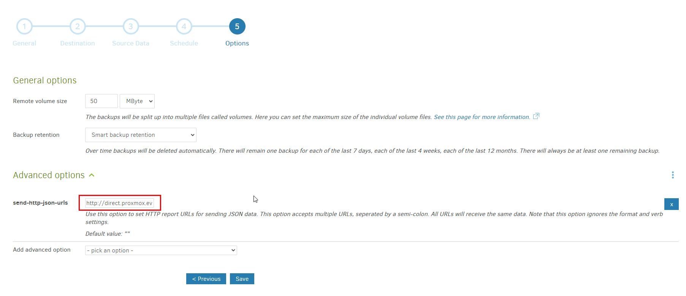
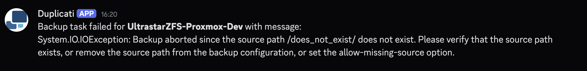
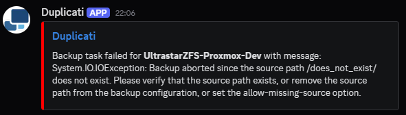

# Duplicati Notify
## Background
Duplicati currently only supports notification via STMP. This minimal server will try add support to discord with `webhook` or more generalized notification service via `apprise`.

## How does this work?
Duplicati job will need to set `--send-http-json-urls` flag. The configured job will fire a JSON object when a backup task is `success`/`success with warning`/`failed`.

This screenshot shows where to modify the Duplicati setting.
(This url is internal. Replace with your own CIDR (http://192.168.1.xxx:\<PORT\>), or FQDN (https://duplicati_notifier.example.com))

1. This `Flask` server will receive such Duplicati JSON object. 
2. It checks the JSON object for any warning `Data.WarningsActualLength` or error `Data.ErrorsActualLength`.
3. Send a notification via `webhook` or `apprise` if warning or error detected.

## Notification Screenshots
### Apprise

Apprise does not support embeds easily, will only send text with markdowns

### Discord

Discord webhook url supports embeds natively, with a bit json construction we can display a nicer notification.

